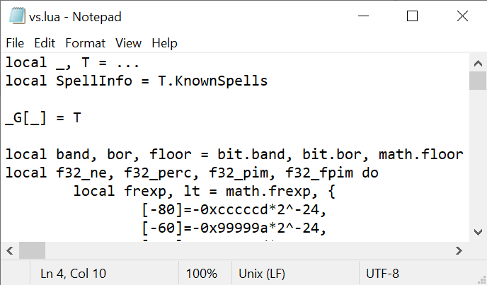

# Addon sites

* [WowInterface](https://www.wowinterface.com/downloads/info26117-VenturePlanSoDMissions.html)

# Legal stuff

VenturePlan does not expose any of its data to other addons, so to have this addon work, you will need to change it to do so. Note that VenturePlan does not have a a licence that permits you to alter its source code, and while it is legal to tinker with source code you're allowed to run in my jurisdiction, it may not be legal in yours. Consult a lawyer if you are worried. Obviously I don't encourage you to do so if it's not legal for you. In any case you should absolutely not redistribute the changes you've made.

# Getting it running

To expose VenturePlan's internal data you will need to edit its source code. Open up Interface/Addons/VenturePlan/vs.lua in a text editor, and insert the line `_G[_] = T` in the first blank space. It should look like this when you're done:

This makes the internal data of the addon (`T`) available to other addons (by putting it in the global table, `_G`, which every addon has available to it). In general you shouldn't be messing with addons like this, because it's a great way of getting hacked, but in this case there's no way around it. _caveat emptor_

# Contributing

If you have updates to the spell list you'd like to include (see `extra-vs-spells.lua`), please open a PR and I'll add them.

## Contributors and thanks

Many thanks to:

* Neurotoxin001
* pyuuwz
* czullo

for contributions and support, as well as to the original author for a great addon.
